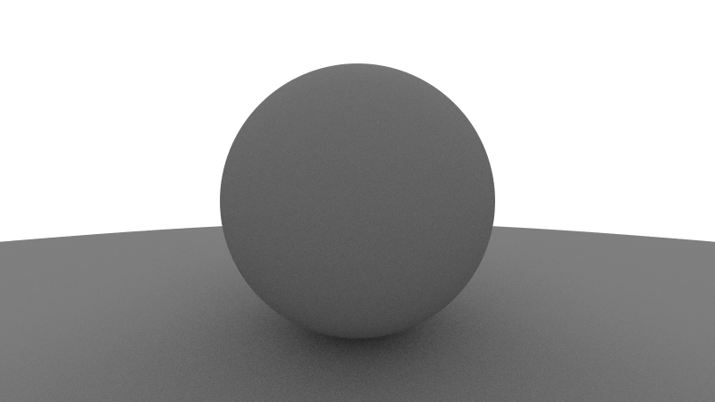
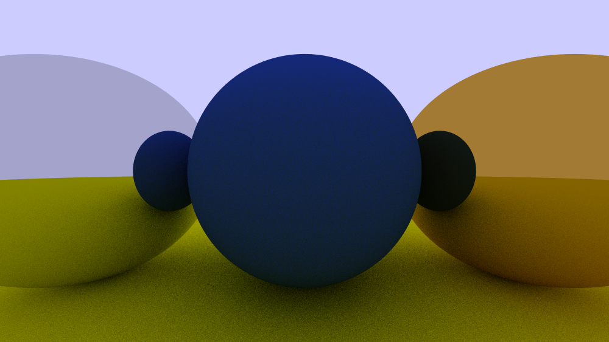
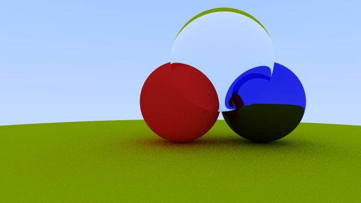
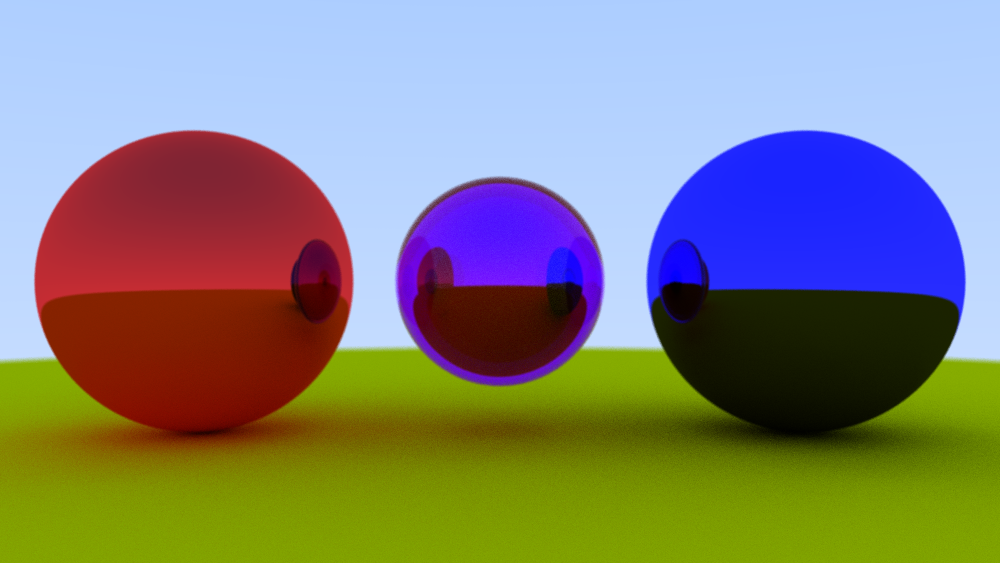
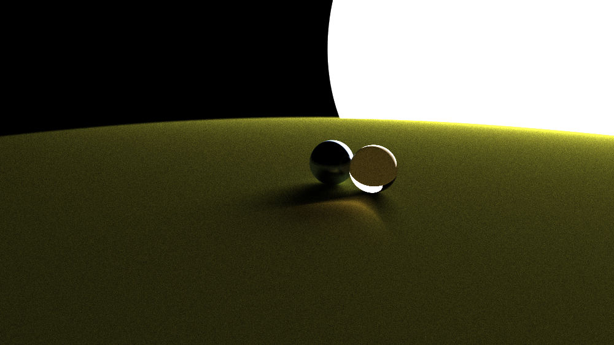

# Simple Ray Tracing

Made in reference with: [Ray Tracing in One Weekend](raytracing.github.io/books/RayTracingInOneWeekend.html)

## Gallery

### Image 1
- First successful render
- Reflected light rays bounce off in random directions

### Image 2
- Metal spheres
- Reflected light rays reflect at the same angle to the normal

### Image 3
- Glass objects (refraction)
- Below demonstrates a glass sphere (refractive index = 1.15)

### Image 4
- Red + Blue = Purple

### Image 5
- Light (and everything else combined)

